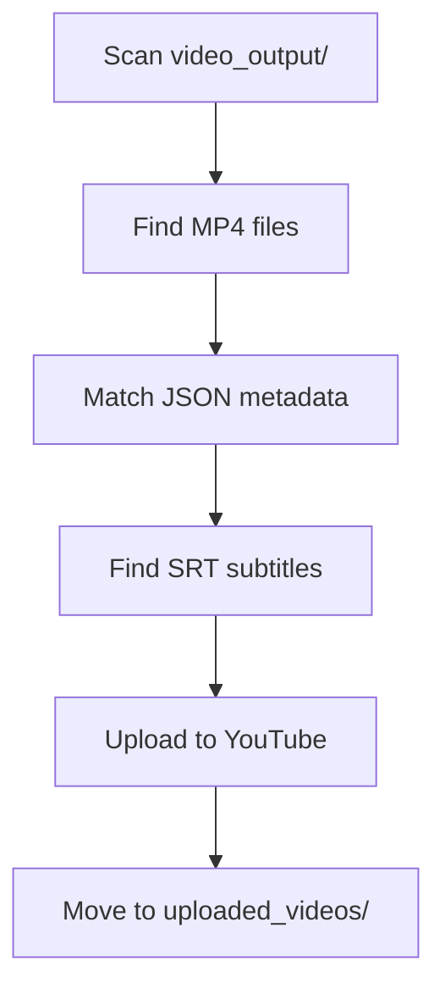

# 🎬 YouTube Auto Upload Tool

Automated YouTube video uploader with multi-language support and subtitle integration. Automatically uploads videos with metadata, schedules optimal publish times, and includes subtitle files.

---

## 📋 Table of Contents

- [Features](#-features)
- [Requirements](#-requirements)
- [Setup Instructions](#-setup-instructions)
- [YouTube API Setup](#-youtube-api-setup)
- [Usage](#-usage)
- [File Structure](#-file-structure)
- [Supported Languages](#-supported-languages)
- [Troubleshooting](#-troubleshooting)

---

## ✨ Features

| Feature | Description |
|---------|-------------|
| **Auto Upload** | Batch upload MP4 videos to YouTube |
| **Multi-language** | Support for English, Romanian, Russian |
| **Subtitle Upload** | Automatic SRT subtitle file integration |
| **Smart Scheduling** | Optimal publish times per region |
| **Metadata Translation** | Auto-translate titles/descriptions |
| **File Management** | Organized file structure after upload |

---

## 🔧 Requirements

### Python Version
- **Python 3.8+** (Recommended: Python 3.9 or higher)

### Dependencies
```txt
google-auth
google-auth-oauthlib
google-auth-httplib2
google-api-python-client
argostranslate>=1.9.4
```

---

## 🚀 Setup Instructions

### 1. Clone Repository
```bash
git clone <repository-url>
cd autoupload_Youtube
```

### 2. Create Virtual Environment
```bash
python -m venv .venv
```

### 3. Activate Virtual Environment
**Windows:**
```bash
.venv\Scripts\activate
```

**Linux/Mac:**
```bash
source .venv/bin/activate
```

### 4. Install Dependencies
```bash
pip install -r requirements.txt
```

---

## 🔑 YouTube API Setup

### Step 1: Create Google Cloud Project
1. Go to [Google Cloud Console](https://console.cloud.google.com/)
2. Create new project or select existing one
3. Enable **YouTube Data API v3**

### Step 2: Create OAuth 2.0 Credentials
1. Navigate to **APIs & Services** → **Credentials**
2. Click **+ CREATE CREDENTIALS** → **OAuth client ID**
3. Choose **Desktop application**
4. Download the JSON file
5. **Rename to `client_secrets.json`**
6. **Place in project root directory**

### Step 3: Required Scopes
The application uses these YouTube API scopes:
- `https://www.googleapis.com/auth/youtube.upload`
- `https://www.googleapis.com/auth/youtube.force-ssl`

### Step 4: First-time Authentication
On first run, the script will:
1. Open browser for Google OAuth
2. Request permissions
3. Create `token.pickle` file for future use

---

## 🎯 Usage

### Quick Start
```bash
# Make start script executable (Linux/Mac)
chmod +x start.sh

# Run the application
./start.sh
```

### Manual Start
```bash
# Activate virtual environment
source .venv/Scripts/activate  # Windows
# source .venv/bin/activate    # Linux/Mac

# Run the script
python auto_upload_script.py
```

### File Organization

#### Input Files Structure
```
video_output/
├── VideoName_en.mp4          # English video
├── VideoName_en.json         # English metadata
├── VideoName_en.srt          # English subtitles
├── VideoName_ro.mp4          # Romanian video
├── VideoName_ro.json         # Romanian metadata
├── VideoName_ro.srt          # Romanian subtitles
├── VideoName_ru.mp4          # Russian video
├── VideoName_ru.json         # Russian metadata
└── VideoName_ru.srt          # Russian subtitles
```

#### JSON Metadata Format
```json
{
  "video_title": "Your Video Title",
  "video_description": "Your video description with details...",
  "video_hashtags": "#tag1, #tag2, #tag3"
}
```

---

## 📁 File Structure

```
autoupload_Youtube/
├── 📁 uploaded_videos/        # Successfully uploaded files
├── 📁 utilites/
│   └── argotranslate.py      # Translation utilities
├── 📄 auto_upload_script.py  # Main upload automation
├── 📄 upload_youtube.py      # YouTube API integration
├── 📄 client_secrets.json    # OAuth credentials (create this)
├── 📄 token.pickle          # Auth token (auto-generated)
├── 📄 requirements.txt      # Python dependencies
├── 📄 start.sh             # Startup script
└── 📄 README.md            # This file
```

---

## 🌍 Supported Languages

| Language | Code | Optimal Publish Time |
|----------|------|---------------------|
| English | `en` | 8:00 PM EST |
| Romanian | `ro` | 8:00 PM EET |
| Russian | `ru` | 9:00 PM MSK |

---

## 🔧 Configuration

### Privacy Settings
Edit `auto_upload_script.py`:
```python
privacy_status="private"  # Options: public, unlisted, private
```

### Video Directory
Update paths in `auto_upload_script.py`:
```python
auto_upload_videos(
    video_dir=r"C:\path\to\your\videos",
    json_dir=r"C:\path\to\your\metadata"
)
```

---

## 🐛 Troubleshooting

### Common Issues

| Issue | Solution |
|-------|----------|
| **Missing client_secrets.json** | Download OAuth credentials from Google Cloud Console |
| **Authentication Error** | Delete `token.pickle` and re-authenticate |
| **Upload Failed** | Check video file format (MP4 recommended) |
| **Subtitle Error** | Ensure SRT files match video filenames exactly |

### Error Messages
- **"No JSON file found"** → Create metadata JSON for each video
- **"Subtitle file not found"** → Check SRT filename matches video name
- **"Invalid credentials"** → Re-download `client_secrets.json`

---

## 📊 Upload Process



---

## 🤝 Contributing

1. Fork the repository
2. Create feature branch
3. Commit changes
4. Push to branch
5. Create Pull Request

---

## 📝 License

This project is licensed under the MIT License.

---

## 🆘 Support

For issues and questions:
1. Check [Troubleshooting](#-troubleshooting) section
2. Review [YouTube API Documentation](https://developers.google.com/youtube/v3)
3. Create GitHub issue with error details